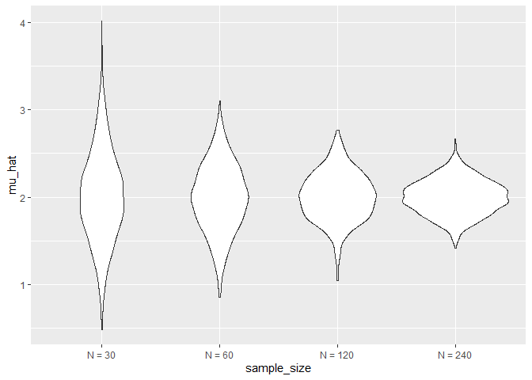
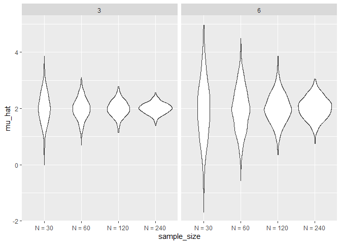

simulations
================
Wenyan Ma
2022-11-03

## Simulation

``` r
sim_mean_sd = function(n_obs, mu = 2, sigma = 3) {
  
  sim_data = tibble(
    x = rnorm(n = n_obs, mean = mu, sd = sigma),
  )
  
  sim_data %>% 
    summarize(
      mu_hat = mean(x),
      sigma_hat = sd(x)
    )
}
```

How did we use this before

``` r
sim_mean_sd(n_obs = 30)
```

    ## # A tibble: 1 × 2
    ##   mu_hat sigma_hat
    ##    <dbl>     <dbl>
    ## 1   2.25      2.77

How can we use this now

start with a for loop

``` r
output = vector("list", length = 100)

for (i in 1:100) {
  
  output[[i]] = sim_mean_sd(n_obs = 30)
}

bind_rows(output)
```

    ## # A tibble: 100 × 2
    ##    mu_hat sigma_hat
    ##     <dbl>     <dbl>
    ##  1   2.40      2.39
    ##  2   2.33      2.88
    ##  3   2.34      2.65
    ##  4   1.01      2.77
    ##  5   2.71      3.17
    ##  6   2.20      3.25
    ##  7   1.29      3.04
    ##  8   2.07      2.79
    ##  9   2.41      3.09
    ## 10   2.65      2.84
    ## # … with 90 more rows

lets use list columns instead

``` r
sim_results_df = 
  expand_grid(
    sample_size = 30,
    iter = 1:100
  ) %>% 
  mutate(
    estimate_df = map(sample_size, sim_mean_sd)
  ) %>% 
  unnest(estimate_df)

sim_results_df %>% 
  ggplot(aes(x = mu_hat)) + 
  geom_density()
```

<!-- -->

!!!!!!!!!!!!!!!!!!!!!!!!!!!!!!!!!!!!!!!!!
!!!!!!!!!!!!!!!!!!!!!!!!!!!!!!!!!!!!!!!!!
!!!!!!!!!!!!!!!!!!!!!!!!!!!!!!!!!!!!!!!!!
!!!!!!!!!!!!!!!!!!!!!!!!!!!!!!!!!!!!!!!!!
!!!!!!!!!!!!!!!!!!!!!!!!!!!!!!!!!!!!!!!!!
!!!!!!!!!!!!!!!!!!!!!!!!!!!!!!!!!!!!!!!!!
!!!!!!!!!!!!!!!!!!!!!!!!!!!!!!!!!!!!!!!!!
!!!!!!!!!!!!!!!!!!!!!!!!!!!!!!!!!!!!!!!!!
!!!!!!!!!!!!!!!!!!!!!!!!!!!!!!!!!!!!!!!!!

## What about changing sample size

I need a input list with a lot of sample

``` r
sim_results_df = 
  expand_grid(
    sample_size = c(30, 60, 120, 240),
    iteration = 1:1000
  ) %>% 
  mutate(
    estimate_df = map(sample_size, sim_mean_sd)
  ) %>% 
  unnest(estimate_df)
```

``` r
sim_results_df %>% 
  mutate(sample_size = str_c("N = ", sample_size),
         sample_size = fct_inorder(sample_size)) %>% 
  ggplot(aes(x = sample_size, y = mu_hat)) +
  geom_violin()
```

<!-- -->

``` r
sim_results_df %>% 
  mutate(sample_size = str_c("N = ", sample_size),
         sample_size = fct_inorder(sample_size)) %>% 
  group_by(sample_size) %>% 
  summarize(emp_st_err = sd(mu_hat))
```

    ## # A tibble: 4 × 2
    ##   sample_size emp_st_err
    ##   <fct>            <dbl>
    ## 1 N = 30           0.524
    ## 2 N = 60           0.393
    ## 3 N = 120          0.280
    ## 4 N = 240          0.198

## Let’s see two inputs

``` r
sim_results_df = 
  expand_grid(
    sample_size = c(30, 60, 120, 240),
    true_sigma = c(6, 3),
    iteration = 1:1000
  ) %>% 
  mutate(estimate_df = map2(.x = sample_size, .y = true_sigma, 
                      ~ sim_mean_sd(n_obs = .x, sigma = .y))) %>% 
  unnest(estimate_df)

sim_results_df %>% 
  mutate(sample_size = str_c("N = ", sample_size),
         sample_size = fct_inorder(sample_size)) %>% 
  ggplot(aes(x = sample_size, y = mu_hat)) +
  geom_violin() +
  facet_grid(.~true_sigma)
```

<!-- -->
